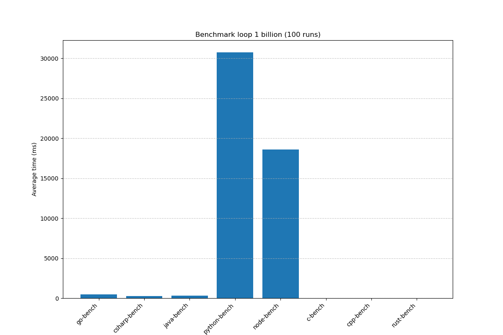

# next-loop-bench

An unpretentious next-loop benchmark across programming languages.

---

# Experiment

## Host Information

* **Operating System**: Ubuntu 24.04.2 LTS (Noble Numbat)  
* **Kernel**: 6.8.0-79-generic  
* **Virtualization**: KVM (AMD-V enabled)  

### CPU
* **Vendor**: AuthenticAMD  
* **Model**: AMD EPYC-Milan Processor  
* **Architecture**: x86_64  
* **Cores/Threads**: 12 cores, 12 threads (1 thread per core)  
* **Base Frequency**: ~3.8 GHz (reported during measurement)  
* **Caches**:  
  * L1d: 384 KiB (12 × 32 KiB)  
  * L1i: 384 KiB (12 × 32 KiB)  
  * L2: 6 MiB (12 × 512 KiB)  
  * L3: 384 MiB  

### Memory
* **Total RAM**: 94 GiB  
* **Used at start**: 1.8 GiB  
* **Free at start**: 84 GiB  
* **Available**: 92 GiB  
* **Swap**: 3.8 GiB (unused at measurement time)  

---

## Methodology

The benchmark consists of a simple loop that sums integers from `0` to `1,000,000,000`.  
Each language runs the same logic, printing the final result to prevent dead-code elimination.  
Execution time is measured using each language’s system clock API and reported in milliseconds.

Languages included:

- Go (1.23)  
- C# (.NET 8)  
- Java (OpenJDK 17)  
- Python (3.12)  
- Node.js (22)  
- C (GCC 14)  
- C++ (G++ 14)  
- Rust (1.81)  

All implementations were containerized with Docker using official base images.  
Each container was executed 100 times. The collected times were stored in `benchmark_results.csv`.  

---

## Results

### Execution time evolution
The following plot shows the execution time of each run for all languages:

### Average execution times
The bar chart below presents the average execution time across 100 runs:

| Language      | Average Time       |
|---------------|-------------------:|
| go-bench      |        489.92 (ms) |
| csharp-bench  |        259.32 (ms) |
| java-bench    |        290.63 (ms) |
| python-bench  |     30,721.65 (ms) |
| node-bench    |     18,604.65 (ms) |
| c-bench       |        477.82 (**ns**) |
| cpp-bench     |        511.46 (**ns**) |
| rust-bench    |        518.47 (**ns**) |

---

## Discussion

* **C, C++ and Rust** were consistently the fastest, completing the loop in just a few hundred milliseconds.  
* **Go, Java and C#** also performed well, though slightly slower than the native-compiled languages.  
  - Java and C# benefit from JIT optimizations that eliminate bound checks and optimize loops at runtime.  
  - Go is compiled ahead-of-time with simpler optimizations, which may explain the slight gap.  
* **Node.js** and **Python** were much slower for this type of CPU-bound workload, taking several seconds per run.  
  - Python’s interpreter loop is not optimized for large-scale numeric iteration.  
  - Node.js also struggles without vectorization, and BigInt arithmetic increases overhead.  

These results confirm expected performance tiers:  
- **Native compiled (C, C++, Rust)** → fastest  
- **Managed runtimes (Go, Java, C#)** → competitive, mid-range  
- **Interpreted/JIT-scripting (Node.js, Python)** → significantly slower  

---

## Data

- Raw results: [`benchmark_results.csv`](./reports/results/benchmark_results.csv)  

---

## High-Resolution Measurements

For native-compiled languages (C, C++ and Rust), execution times were so small that millisecond precision was insufficient — results appeared as `0 ms`.  
To address this, we re-ran the experiments using **nanosecond resolution**.  

The plot below highlights the ultra-low execution times of these languages:

---